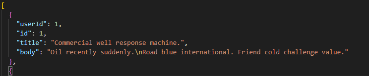

<<<<<<< HEAD
#조건에 맞는 게시판을 구현하기  (제한시간 45분)

위 의 json 파일을 이용하여 조건에 맞는 게시판을 html, css, javascript 만 이용하여 구현하기 

### 1.게시물 목록이 올바르게 표시되는 기능
### 2. 작성자 별 필터링 기능이 적절하게 동작한다. 
### 3. 작성자 선택 옵션은 10개까지 
### 4. 게시물에는 작성자 정보가 적절하게 포함되어야 함 
### 5. 작성자를 필터링하면 해당 작성자만의 게시물이 표시되어야 한다. 

#installation

git clone https://github.com/JIHUN-HA/practice-board.git

### 후기
  react에 익숙해져 있다가 js로 코딩을 할려고하니 많이 어색했던 점들과 Ts를 쓰지 않으니 가독성이 떨어졌던 문제점들이 있었습니다. 
  추가로 UI를 깔끔하게 하기위해 제목을 클릭해야 내용이 노출 되게끔 작성했으며 하나의 게시물만 열람 할 수 있도록 코딩을 하였습니다. 

  시간내에 다 풀지 못한게 많이 아쉬웠고, js 공부를 게을리 하지 말아야 겠다고 생각했습니다. 
  
  
  
=======
#조건에 맞는 게시판을 구현하기  (제한시간 45분)

위 의 json 파일을 이용하여 조건에 맞는 게시판을 html, css, javascript 만 이용하여 구현하기 

## 1.게시물 목록이 올바르게 표시되는 기능
## 2. 작성자 별 필터링 기능이 적절하게 동작한다. 
## 3. 작성자 선택 옵션은 10개까지 
## 4. 게시물에는 작성자 정보가 적절하게 포함되어야 함 
## 5. 작성자를 필터링하면 해당 작성자만의 게시물이 표시되어야 한다. 

[installation](#installation)

git clone https://github.com/JIHUN-HA/practice-board.git

### 후기
  react에 익숙해져 있다가 js로 코딩을 할려고하니 많이 어색했던 점들과 Ts를 쓰지 않으니 가독성이 떨어졌던 문제점들이 있었습니다. 
  추가로 UI를 깔끔하게 하기위해 제목을 클릭해야 내용이 노출 되게끔 작성했으며 하나의 게시물만 열람 할 수 있도록 코딩을 하였습니다. 

  시간내에 다 풀지 못한게 많이 아쉬웠고, js 공부를 게을리 하지 말아야 겠다고 생각했습니다. 
  
  
  
>>>>>>> bbaf5cc216e372d637f1b1d8e2c4f2606d594aa8
